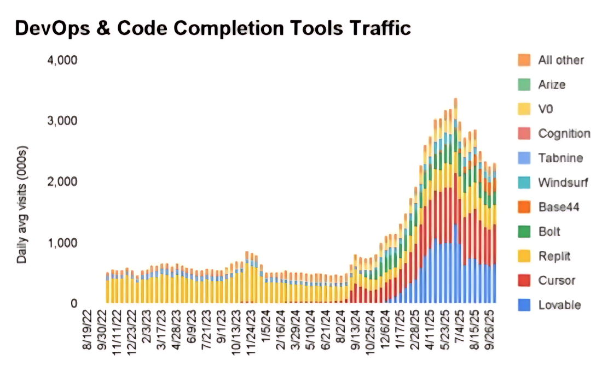
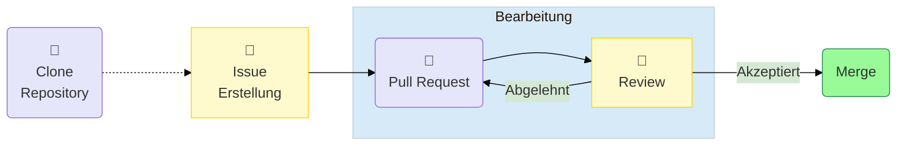

<!--

author:   Volker Göhler
email:    volker.goehler@informatik.tu-freiberg.de
version:  0.0.1
language: de
narrator: Deutsch Female

edit: true
date: 2026-05-26

icon: img/TUBAF_Logo_blau.png
comment:  Moderationsfolien zu AI Literacy

import: https://raw.githubusercontent.com/liaScript/mermaid_template/master/README.md
import: https://raw.githubusercontent.com/liascript-templates/plantUML/master/README.md

link:   https://raw.githubusercontent.com/vgoehler/LiaScript_CSS_Provider/refs/heads/main/dist/university.css

tags: [ Sommersemester2026, Softwareentwicklung]

-->

# Einstieg in AI-Literacy

Softwareentwicklung von eingebetteten Systemen SoSe2026
=======================================================

## AI Publications

![LLM and Education Papers Headlines \[1-6\]](img/overview_paper_llm_edu.jpg "LLM and Education Papers Headlines \[1-6\]")

LLM use in Higher Education
====================

![Results from a 2025 Study by HEPI, UK of 1041 undergraduate students \[7\]. ](img/freeman25_fig1.png "Results from a 2025 Study by HEPI, UK of 1041 undergraduate students \[7\].")

Programming Popularity Surge
====================

## LLM use in Programming Education

LLMs wie ChatGPT, Copilot, Gemini, Claude, Mistral, ... verändern die Programmierausbildung.

Wirft die Frage auf: 
---

- Wie kompetent sind Studierende in der Zusammenarbeit mit KI?
- Wie kann die Lehre diese Kompetenzen fördern?

## Warum AI-Literacy?

> AI Literacy = Fähigkeit, KI effektiv, verantwortungsvoll und kollaborativ einzusetzen.
> (Long & Magerko, 2020)

Was umfasst AI-Literacy?
===========

- Technisches Verständnis (z.B. Grundlagen von ML, Datenverarbeitung)
- Kritische Reflexion (z.B. Bias, Ethik, Grenzen von KI)
- Praktische Anwendung (z.B. Tools wie Copilot, Prompt-Engineering)

Warum ist das wichtig?
===========

- Reflektierter Umgang mit KI → Vermeidung von Fehlanwendungen
- Nicht nur Effizienz, sondern Verantwortung im Einsatz

## Agentic Software Development

Mensch-Agenten Interaktion in Software Entwicklung
=====

*Phase 1:*

**Phase 2:**

?

## Frage

<!-- style="font-size:2.5em;" -->
“Wie nutzt ihr KI aktuell?”

## Umfrage AI-Literacy

[qr-code](https://limesurvey.hrz.tu-freiberg.de/index.php/131519?lang=de "https://limesurvey.hrz.tu-freiberg.de/index.php/131519")

<section class="flex-container">

- english
- deutsch 
- 10-15 min

**[https://t1p.de/6socg](https://t1p.de/6socg)**

</section>

## References

<!-- style="font-size:0.8em;" -->
- [1] N. Kosmyna u. a., „Your Brain on ChatGPT: Accumulation of Cognitive Debt when Using an AI Assistant for Essay Writing Task“, Juni 2025, Verfügbar unter: https://arxiv.org/pdf/2506.08872
- [2] M. De u. a., „From Chalkboards to Chatbots Evaluating the Impact of Generative AI on Learning Outcomes in Nigeria“, 2025. Verfügbar unter: http://www.worldbank.org/prwp.
- [3] S. Wang, F. Wang, Z. Zhu, J. Wang, T. Tran, und Z. Du, „Artificial intelligence in education: A systematic literature review“, Expert Systems with Applications, Bd. 252, S. 124167, Okt. 2024, doi: 10.1016/J.ESWA.2024.124167.
- [4] R. Deng, M. Jiang, X. Yu, Y. Lu, und S. Liu, „Does ChatGPT enhance student learning? A systematic review and meta-analysis of experimental studies“, Computers & Education, Bd. 227, S. 105224, Apr. 2025, doi: 10.1016/J.COMPEDU.2024.105224.
- [5] D. Ovalle, „Is AI rewiring our minds? Scientists probe cognitive cost of chatbots.“, Washington Post. Juni 2025. Verfügbar unter: https://www.washingtonpost.com/health/2025/06/29/chatgpt-ai-brain-impact/
- [6] B. Klimova und M. Pikhart, „Exploring the effects of artificial intelligence on student and academic well-being in higher education: a mini-review“, Frontiers in Psychology, Bd. 16, S. 1498132, Feb. 2025, doi: 10.3389/FPSYG.2025.1498132/BIBTEX.
- [7] J. Freeman, „Student Generative AI Survey 2025“, Higher Education Policy Institute, Feb. 2025. Verfügbar unter: https://www.hepi.ac.uk/reports/student-generative-ai-survey-2025/
